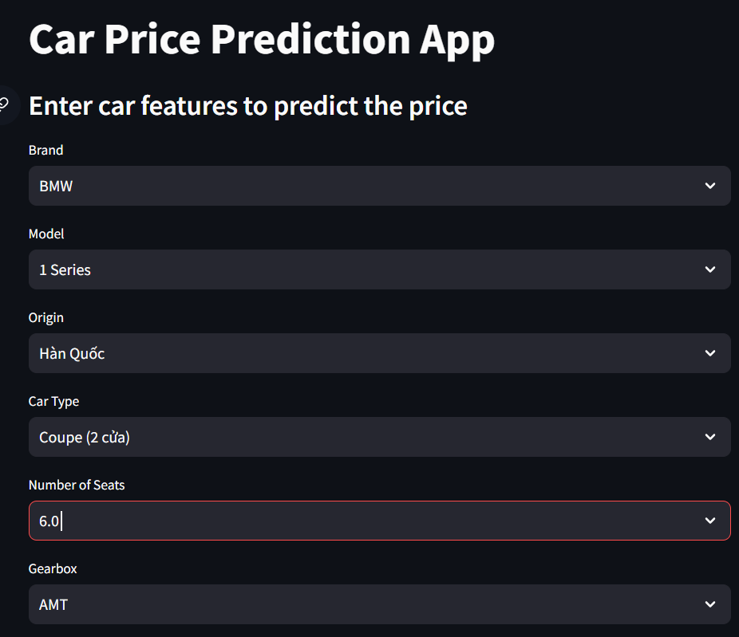
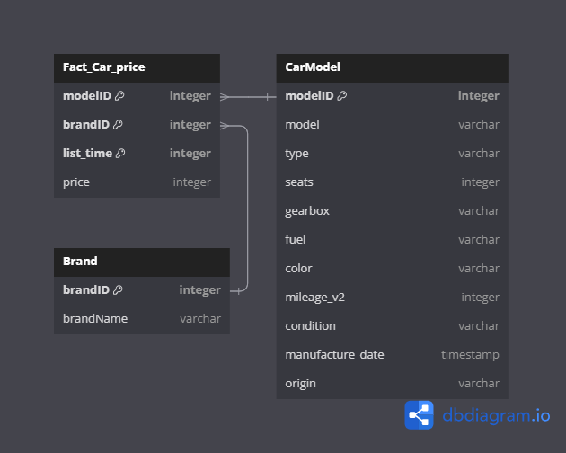

### Vucar - Used Car Prediction ###

Dataset: [car.csv](path/to/car.csv)

Build model: [notebook](path/to/notebook.ipynb)

Flask API: [main.py](path/to/main.py)

Streamlit: [app.py](path/to/app.py)

Weight: [models/rf.pkl](path/to/models/rf.pkl)

UI:

DB schema:

